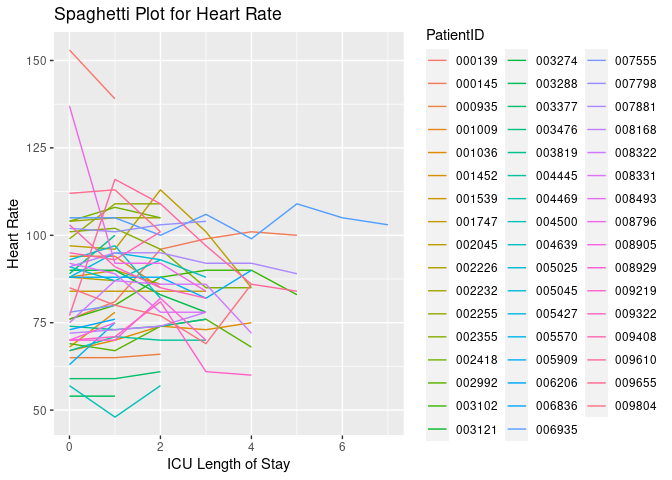
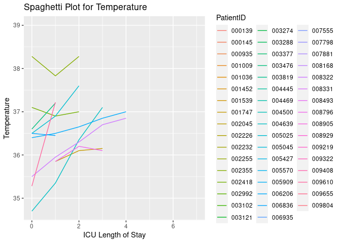
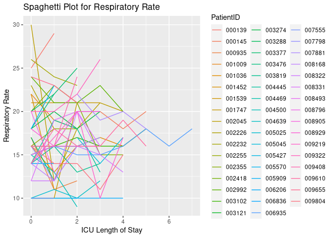

Assignment 7 Dynamic Report
================
Santiago Charry

## This report was created at 2023-04-06 00:41:23

## Table of All Patients Vital Changes in Their Latest Hour

Change in vitals over each patient’s latest hour.

    No encoding supplied: defaulting to UTF-8.

    Rows: 1958 Columns: 7
    ── Column specification ────────────────────────────────────────────────────────
    Delimiter: ","
    chr  (1): PatientID
    dbl  (5): ICULOS, HR, Temp, Resp, SepsisLabel
    dttm (1): obsTime

    ℹ Use `spec()` to retrieve the full column specification for this data.
    ℹ Specify the column types or set `show_col_types = FALSE` to quiet this message.

<table class="gt_table" data-quarto-disable-processing="false" data-quarto-bootstrap="false">
  <thead>
    
    <tr class="gt_col_headings">
      <th class="gt_col_heading gt_columns_bottom_border gt_right" rowspan="1" colspan="1" scope="col" id="PatientID">PatientID</th>
      <th class="gt_col_heading gt_columns_bottom_border gt_right" rowspan="1" colspan="1" scope="col" id="HR_Change">HR_Change</th>
      <th class="gt_col_heading gt_columns_bottom_border gt_right" rowspan="1" colspan="1" scope="col" id="Temp_Change">Temp_Change</th>
      <th class="gt_col_heading gt_columns_bottom_border gt_right" rowspan="1" colspan="1" scope="col" id="Resp_Change">Resp_Change</th>
    </tr>
  </thead>
  <tbody class="gt_table_body">
    <tr><td headers="PatientID" class="gt_row gt_right">000139</td>
<td headers="HR_Change" class="gt_row gt_right">14</td>
<td headers="Temp_Change" class="gt_row gt_right">NA</td>
<td headers="Resp_Change" class="gt_row gt_right">-4</td></tr>
    <tr><td headers="PatientID" class="gt_row gt_right">000145</td>
<td headers="HR_Change" class="gt_row gt_right">1</td>
<td headers="Temp_Change" class="gt_row gt_right">NA</td>
<td headers="Resp_Change" class="gt_row gt_right">-2</td></tr>
    <tr><td headers="PatientID" class="gt_row gt_right">000935</td>
<td headers="HR_Change" class="gt_row gt_right">-1</td>
<td headers="Temp_Change" class="gt_row gt_right">NA</td>
<td headers="Resp_Change" class="gt_row gt_right">-1</td></tr>
    <tr><td headers="PatientID" class="gt_row gt_right">001009</td>
<td headers="HR_Change" class="gt_row gt_right">9</td>
<td headers="Temp_Change" class="gt_row gt_right">NA</td>
<td headers="Resp_Change" class="gt_row gt_right">1</td></tr>
    <tr><td headers="PatientID" class="gt_row gt_right">001036</td>
<td headers="HR_Change" class="gt_row gt_right">-2</td>
<td headers="Temp_Change" class="gt_row gt_right">NA</td>
<td headers="Resp_Change" class="gt_row gt_right">1</td></tr>
    <tr><td headers="PatientID" class="gt_row gt_right">001452</td>
<td headers="HR_Change" class="gt_row gt_right">-10</td>
<td headers="Temp_Change" class="gt_row gt_right">NA</td>
<td headers="Resp_Change" class="gt_row gt_right">11</td></tr>
    <tr><td headers="PatientID" class="gt_row gt_right">001539</td>
<td headers="HR_Change" class="gt_row gt_right">4</td>
<td headers="Temp_Change" class="gt_row gt_right">NA</td>
<td headers="Resp_Change" class="gt_row gt_right">0</td></tr>
    <tr><td headers="PatientID" class="gt_row gt_right">001747</td>
<td headers="HR_Change" class="gt_row gt_right">0</td>
<td headers="Temp_Change" class="gt_row gt_right">-0.05</td>
<td headers="Resp_Change" class="gt_row gt_right">0</td></tr>
    <tr><td headers="PatientID" class="gt_row gt_right">002045</td>
<td headers="HR_Change" class="gt_row gt_right">16</td>
<td headers="Temp_Change" class="gt_row gt_right">NA</td>
<td headers="Resp_Change" class="gt_row gt_right">1</td></tr>
    <tr><td headers="PatientID" class="gt_row gt_right">002226</td>
<td headers="HR_Change" class="gt_row gt_right">1</td>
<td headers="Temp_Change" class="gt_row gt_right">NA</td>
<td headers="Resp_Change" class="gt_row gt_right">5</td></tr>
    <tr><td headers="PatientID" class="gt_row gt_right">002232</td>
<td headers="HR_Change" class="gt_row gt_right">0</td>
<td headers="Temp_Change" class="gt_row gt_right">NA</td>
<td headers="Resp_Change" class="gt_row gt_right">1</td></tr>
    <tr><td headers="PatientID" class="gt_row gt_right">002255</td>
<td headers="HR_Change" class="gt_row gt_right">0</td>
<td headers="Temp_Change" class="gt_row gt_right">NA</td>
<td headers="Resp_Change" class="gt_row gt_right">0</td></tr>
    <tr><td headers="PatientID" class="gt_row gt_right">002355</td>
<td headers="HR_Change" class="gt_row gt_right">0</td>
<td headers="Temp_Change" class="gt_row gt_right">NA</td>
<td headers="Resp_Change" class="gt_row gt_right">0</td></tr>
    <tr><td headers="PatientID" class="gt_row gt_right">002418</td>
<td headers="HR_Change" class="gt_row gt_right">3</td>
<td headers="Temp_Change" class="gt_row gt_right">-0.10</td>
<td headers="Resp_Change" class="gt_row gt_right">0</td></tr>
    <tr><td headers="PatientID" class="gt_row gt_right">002992</td>
<td headers="HR_Change" class="gt_row gt_right">8</td>
<td headers="Temp_Change" class="gt_row gt_right">NA</td>
<td headers="Resp_Change" class="gt_row gt_right">3</td></tr>
    <tr><td headers="PatientID" class="gt_row gt_right">003102</td>
<td headers="HR_Change" class="gt_row gt_right">7</td>
<td headers="Temp_Change" class="gt_row gt_right">NA</td>
<td headers="Resp_Change" class="gt_row gt_right">-2</td></tr>
    <tr><td headers="PatientID" class="gt_row gt_right">003121</td>
<td headers="HR_Change" class="gt_row gt_right">NA</td>
<td headers="Temp_Change" class="gt_row gt_right">NA</td>
<td headers="Resp_Change" class="gt_row gt_right">NA</td></tr>
    <tr><td headers="PatientID" class="gt_row gt_right">003274</td>
<td headers="HR_Change" class="gt_row gt_right">5</td>
<td headers="Temp_Change" class="gt_row gt_right">NA</td>
<td headers="Resp_Change" class="gt_row gt_right">-2</td></tr>
    <tr><td headers="PatientID" class="gt_row gt_right">003288</td>
<td headers="HR_Change" class="gt_row gt_right">0</td>
<td headers="Temp_Change" class="gt_row gt_right">NA</td>
<td headers="Resp_Change" class="gt_row gt_right">5</td></tr>
    <tr><td headers="PatientID" class="gt_row gt_right">003377</td>
<td headers="HR_Change" class="gt_row gt_right">-2</td>
<td headers="Temp_Change" class="gt_row gt_right">NA</td>
<td headers="Resp_Change" class="gt_row gt_right">-3</td></tr>
    <tr><td headers="PatientID" class="gt_row gt_right">003476</td>
<td headers="HR_Change" class="gt_row gt_right">-11</td>
<td headers="Temp_Change" class="gt_row gt_right">-0.60</td>
<td headers="Resp_Change" class="gt_row gt_right">-4</td></tr>
    <tr><td headers="PatientID" class="gt_row gt_right">003819</td>
<td headers="HR_Change" class="gt_row gt_right">-2</td>
<td headers="Temp_Change" class="gt_row gt_right">NA</td>
<td headers="Resp_Change" class="gt_row gt_right">-1</td></tr>
    <tr><td headers="PatientID" class="gt_row gt_right">004445</td>
<td headers="HR_Change" class="gt_row gt_right">0</td>
<td headers="Temp_Change" class="gt_row gt_right">NA</td>
<td headers="Resp_Change" class="gt_row gt_right">5</td></tr>
    <tr><td headers="PatientID" class="gt_row gt_right">004469</td>
<td headers="HR_Change" class="gt_row gt_right">NA</td>
<td headers="Temp_Change" class="gt_row gt_right">NA</td>
<td headers="Resp_Change" class="gt_row gt_right">NA</td></tr>
    <tr><td headers="PatientID" class="gt_row gt_right">004500</td>
<td headers="HR_Change" class="gt_row gt_right">-9</td>
<td headers="Temp_Change" class="gt_row gt_right">NA</td>
<td headers="Resp_Change" class="gt_row gt_right">4</td></tr>
    <tr><td headers="PatientID" class="gt_row gt_right">004639</td>
<td headers="HR_Change" class="gt_row gt_right">5</td>
<td headers="Temp_Change" class="gt_row gt_right">-0.75</td>
<td headers="Resp_Change" class="gt_row gt_right">-2</td></tr>
    <tr><td headers="PatientID" class="gt_row gt_right">005025</td>
<td headers="HR_Change" class="gt_row gt_right">15</td>
<td headers="Temp_Change" class="gt_row gt_right">-0.70</td>
<td headers="Resp_Change" class="gt_row gt_right">1</td></tr>
    <tr><td headers="PatientID" class="gt_row gt_right">005045</td>
<td headers="HR_Change" class="gt_row gt_right">NA</td>
<td headers="Temp_Change" class="gt_row gt_right">NA</td>
<td headers="Resp_Change" class="gt_row gt_right">-3</td></tr>
    <tr><td headers="PatientID" class="gt_row gt_right">005427</td>
<td headers="HR_Change" class="gt_row gt_right">2</td>
<td headers="Temp_Change" class="gt_row gt_right">NA</td>
<td headers="Resp_Change" class="gt_row gt_right">0</td></tr>
    <tr><td headers="PatientID" class="gt_row gt_right">005570</td>
<td headers="HR_Change" class="gt_row gt_right">NA</td>
<td headers="Temp_Change" class="gt_row gt_right">NA</td>
<td headers="Resp_Change" class="gt_row gt_right">NA</td></tr>
    <tr><td headers="PatientID" class="gt_row gt_right">005909</td>
<td headers="HR_Change" class="gt_row gt_right">-12</td>
<td headers="Temp_Change" class="gt_row gt_right">NA</td>
<td headers="Resp_Change" class="gt_row gt_right">-5</td></tr>
    <tr><td headers="PatientID" class="gt_row gt_right">006206</td>
<td headers="HR_Change" class="gt_row gt_right">-8</td>
<td headers="Temp_Change" class="gt_row gt_right">-0.15</td>
<td headers="Resp_Change" class="gt_row gt_right">0</td></tr>
    <tr><td headers="PatientID" class="gt_row gt_right">006836</td>
<td headers="HR_Change" class="gt_row gt_right">-3</td>
<td headers="Temp_Change" class="gt_row gt_right">0.05</td>
<td headers="Resp_Change" class="gt_row gt_right">0</td></tr>
    <tr><td headers="PatientID" class="gt_row gt_right">006935</td>
<td headers="HR_Change" class="gt_row gt_right">2</td>
<td headers="Temp_Change" class="gt_row gt_right">NA</td>
<td headers="Resp_Change" class="gt_row gt_right">-2</td></tr>
    <tr><td headers="PatientID" class="gt_row gt_right">007555</td>
<td headers="HR_Change" class="gt_row gt_right">-2</td>
<td headers="Temp_Change" class="gt_row gt_right">NA</td>
<td headers="Resp_Change" class="gt_row gt_right">0</td></tr>
    <tr><td headers="PatientID" class="gt_row gt_right">007798</td>
<td headers="HR_Change" class="gt_row gt_right">-1</td>
<td headers="Temp_Change" class="gt_row gt_right">NA</td>
<td headers="Resp_Change" class="gt_row gt_right">-1</td></tr>
    <tr><td headers="PatientID" class="gt_row gt_right">007881</td>
<td headers="HR_Change" class="gt_row gt_right">3</td>
<td headers="Temp_Change" class="gt_row gt_right">NA</td>
<td headers="Resp_Change" class="gt_row gt_right">2</td></tr>
    <tr><td headers="PatientID" class="gt_row gt_right">008168</td>
<td headers="HR_Change" class="gt_row gt_right">-4</td>
<td headers="Temp_Change" class="gt_row gt_right">NA</td>
<td headers="Resp_Change" class="gt_row gt_right">1</td></tr>
    <tr><td headers="PatientID" class="gt_row gt_right">008322</td>
<td headers="HR_Change" class="gt_row gt_right">14</td>
<td headers="Temp_Change" class="gt_row gt_right">-0.15</td>
<td headers="Resp_Change" class="gt_row gt_right">2</td></tr>
    <tr><td headers="PatientID" class="gt_row gt_right">008331</td>
<td headers="HR_Change" class="gt_row gt_right">0</td>
<td headers="Temp_Change" class="gt_row gt_right">NA</td>
<td headers="Resp_Change" class="gt_row gt_right">4</td></tr>
    <tr><td headers="PatientID" class="gt_row gt_right">008493</td>
<td headers="HR_Change" class="gt_row gt_right">NA</td>
<td headers="Temp_Change" class="gt_row gt_right">NA</td>
<td headers="Resp_Change" class="gt_row gt_right">NA</td></tr>
    <tr><td headers="PatientID" class="gt_row gt_right">008796</td>
<td headers="HR_Change" class="gt_row gt_right">8</td>
<td headers="Temp_Change" class="gt_row gt_right">0.10</td>
<td headers="Resp_Change" class="gt_row gt_right">0</td></tr>
    <tr><td headers="PatientID" class="gt_row gt_right">008905</td>
<td headers="HR_Change" class="gt_row gt_right">-5</td>
<td headers="Temp_Change" class="gt_row gt_right">NA</td>
<td headers="Resp_Change" class="gt_row gt_right">7</td></tr>
    <tr><td headers="PatientID" class="gt_row gt_right">008929</td>
<td headers="HR_Change" class="gt_row gt_right">12</td>
<td headers="Temp_Change" class="gt_row gt_right">NA</td>
<td headers="Resp_Change" class="gt_row gt_right">0</td></tr>
    <tr><td headers="PatientID" class="gt_row gt_right">009219</td>
<td headers="HR_Change" class="gt_row gt_right">1</td>
<td headers="Temp_Change" class="gt_row gt_right">NA</td>
<td headers="Resp_Change" class="gt_row gt_right">-7</td></tr>
    <tr><td headers="PatientID" class="gt_row gt_right">009322</td>
<td headers="HR_Change" class="gt_row gt_right">3</td>
<td headers="Temp_Change" class="gt_row gt_right">NA</td>
<td headers="Resp_Change" class="gt_row gt_right">-4</td></tr>
    <tr><td headers="PatientID" class="gt_row gt_right">009408</td>
<td headers="HR_Change" class="gt_row gt_right">-8</td>
<td headers="Temp_Change" class="gt_row gt_right">NA</td>
<td headers="Resp_Change" class="gt_row gt_right">-8</td></tr>
    <tr><td headers="PatientID" class="gt_row gt_right">009610</td>
<td headers="HR_Change" class="gt_row gt_right">2</td>
<td headers="Temp_Change" class="gt_row gt_right">NA</td>
<td headers="Resp_Change" class="gt_row gt_right">3</td></tr>
    <tr><td headers="PatientID" class="gt_row gt_right">009655</td>
<td headers="HR_Change" class="gt_row gt_right">12</td>
<td headers="Temp_Change" class="gt_row gt_right">NA</td>
<td headers="Resp_Change" class="gt_row gt_right">2</td></tr>
    <tr><td headers="PatientID" class="gt_row gt_right">009804</td>
<td headers="HR_Change" class="gt_row gt_right">-17</td>
<td headers="Temp_Change" class="gt_row gt_right">NA</td>
<td headers="Resp_Change" class="gt_row gt_right">-4</td></tr>
  </tbody>
  
  
</table>

## Table of Current Sepsis Patients + Vitals

Patients who currently have sepsis along with current heart rate,
temperature, and respiratory rate.

<table class="gt_table" data-quarto-disable-processing="false" data-quarto-bootstrap="false">
  <thead>
    
    <tr class="gt_col_headings">
      <th class="gt_col_heading gt_columns_bottom_border gt_right" rowspan="1" colspan="1" scope="col" id="PatientID">PatientID</th>
      <th class="gt_col_heading gt_columns_bottom_border gt_right" rowspan="1" colspan="1" scope="col" id="HR">HR</th>
      <th class="gt_col_heading gt_columns_bottom_border gt_right" rowspan="1" colspan="1" scope="col" id="Temp">Temp</th>
      <th class="gt_col_heading gt_columns_bottom_border gt_right" rowspan="1" colspan="1" scope="col" id="Resp">Resp</th>
    </tr>
  </thead>
  <tbody class="gt_table_body">
    <tr><td headers="PatientID" class="gt_row gt_right">000139</td>
<td headers="HR" class="gt_row gt_right">139</td>
<td headers="Temp" class="gt_row gt_right">NA</td>
<td headers="Resp" class="gt_row gt_right">29</td></tr>
    <tr><td headers="PatientID" class="gt_row gt_right">000145</td>
<td headers="HR" class="gt_row gt_right">100</td>
<td headers="Temp" class="gt_row gt_right">NA</td>
<td headers="Resp" class="gt_row gt_right">20</td></tr>
    <tr><td headers="PatientID" class="gt_row gt_right">000935</td>
<td headers="HR" class="gt_row gt_right">66</td>
<td headers="Temp" class="gt_row gt_right">36.44</td>
<td headers="Resp" class="gt_row gt_right">12</td></tr>
    <tr><td headers="PatientID" class="gt_row gt_right">001009</td>
<td headers="HR" class="gt_row gt_right">85</td>
<td headers="Temp" class="gt_row gt_right">NA</td>
<td headers="Resp" class="gt_row gt_right">18</td></tr>
    <tr><td headers="PatientID" class="gt_row gt_right">001036</td>
<td headers="HR" class="gt_row gt_right">75</td>
<td headers="Temp" class="gt_row gt_right">NA</td>
<td headers="Resp" class="gt_row gt_right">16</td></tr>
    <tr><td headers="PatientID" class="gt_row gt_right">001452</td>
<td headers="HR" class="gt_row gt_right">78</td>
<td headers="Temp" class="gt_row gt_right">37.22</td>
<td headers="Resp" class="gt_row gt_right">11</td></tr>
    <tr><td headers="PatientID" class="gt_row gt_right">001539</td>
<td headers="HR" class="gt_row gt_right">86</td>
<td headers="Temp" class="gt_row gt_right">NA</td>
<td headers="Resp" class="gt_row gt_right">21</td></tr>
    <tr><td headers="PatientID" class="gt_row gt_right">001747</td>
<td headers="HR" class="gt_row gt_right">84</td>
<td headers="Temp" class="gt_row gt_right">36.15</td>
<td headers="Resp" class="gt_row gt_right">21</td></tr>
    <tr><td headers="PatientID" class="gt_row gt_right">002045</td>
<td headers="HR" class="gt_row gt_right">85</td>
<td headers="Temp" class="gt_row gt_right">36.83</td>
<td headers="Resp" class="gt_row gt_right">20</td></tr>
    <tr><td headers="PatientID" class="gt_row gt_right">002226</td>
<td headers="HR" class="gt_row gt_right">87</td>
<td headers="Temp" class="gt_row gt_right">NA</td>
<td headers="Resp" class="gt_row gt_right">18</td></tr>
    <tr><td headers="PatientID" class="gt_row gt_right">002232</td>
<td headers="HR" class="gt_row gt_right">105</td>
<td headers="Temp" class="gt_row gt_right">NA</td>
<td headers="Resp" class="gt_row gt_right">23</td></tr>
    <tr><td headers="PatientID" class="gt_row gt_right">002255</td>
<td headers="HR" class="gt_row gt_right">109</td>
<td headers="Temp" class="gt_row gt_right">NA</td>
<td headers="Resp" class="gt_row gt_right">18</td></tr>
    <tr><td headers="PatientID" class="gt_row gt_right">002355</td>
<td headers="HR" class="gt_row gt_right">85</td>
<td headers="Temp" class="gt_row gt_right">NA</td>
<td headers="Resp" class="gt_row gt_right">15</td></tr>
    <tr><td headers="PatientID" class="gt_row gt_right">002418</td>
<td headers="HR" class="gt_row gt_right">105</td>
<td headers="Temp" class="gt_row gt_right">37.00</td>
<td headers="Resp" class="gt_row gt_right">16</td></tr>
    <tr><td headers="PatientID" class="gt_row gt_right">002992</td>
<td headers="HR" class="gt_row gt_right">68</td>
<td headers="Temp" class="gt_row gt_right">NA</td>
<td headers="Resp" class="gt_row gt_right">20</td></tr>
    <tr><td headers="PatientID" class="gt_row gt_right">003102</td>
<td headers="HR" class="gt_row gt_right">83</td>
<td headers="Temp" class="gt_row gt_right">NA</td>
<td headers="Resp" class="gt_row gt_right">18</td></tr>
    <tr><td headers="PatientID" class="gt_row gt_right">003121</td>
<td headers="HR" class="gt_row gt_right">90</td>
<td headers="Temp" class="gt_row gt_right">NA</td>
<td headers="Resp" class="gt_row gt_right">20</td></tr>
    <tr><td headers="PatientID" class="gt_row gt_right">003274</td>
<td headers="HR" class="gt_row gt_right">78</td>
<td headers="Temp" class="gt_row gt_right">NA</td>
<td headers="Resp" class="gt_row gt_right">20</td></tr>
    <tr><td headers="PatientID" class="gt_row gt_right">003288</td>
<td headers="HR" class="gt_row gt_right">54</td>
<td headers="Temp" class="gt_row gt_right">NA</td>
<td headers="Resp" class="gt_row gt_right">12</td></tr>
    <tr><td headers="PatientID" class="gt_row gt_right">003377</td>
<td headers="HR" class="gt_row gt_right">61</td>
<td headers="Temp" class="gt_row gt_right">NA</td>
<td headers="Resp" class="gt_row gt_right">25</td></tr>
    <tr><td headers="PatientID" class="gt_row gt_right">003476</td>
<td headers="HR" class="gt_row gt_right">100</td>
<td headers="Temp" class="gt_row gt_right">37.20</td>
<td headers="Resp" class="gt_row gt_right">22</td></tr>
    <tr><td headers="PatientID" class="gt_row gt_right">003819</td>
<td headers="HR" class="gt_row gt_right">76</td>
<td headers="Temp" class="gt_row gt_right">NA</td>
<td headers="Resp" class="gt_row gt_right">14</td></tr>
    <tr><td headers="PatientID" class="gt_row gt_right">004445</td>
<td headers="HR" class="gt_row gt_right">70</td>
<td headers="Temp" class="gt_row gt_right">NA</td>
<td headers="Resp" class="gt_row gt_right">13</td></tr>
    <tr><td headers="PatientID" class="gt_row gt_right">004469</td>
<td headers="HR" class="gt_row gt_right">76</td>
<td headers="Temp" class="gt_row gt_right">NA</td>
<td headers="Resp" class="gt_row gt_right">20</td></tr>
    <tr><td headers="PatientID" class="gt_row gt_right">004500</td>
<td headers="HR" class="gt_row gt_right">57</td>
<td headers="Temp" class="gt_row gt_right">36.06</td>
<td headers="Resp" class="gt_row gt_right">9</td></tr>
    <tr><td headers="PatientID" class="gt_row gt_right">004639</td>
<td headers="HR" class="gt_row gt_right">88</td>
<td headers="Temp" class="gt_row gt_right">37.10</td>
<td headers="Resp" class="gt_row gt_right">12</td></tr>
    <tr><td headers="PatientID" class="gt_row gt_right">005025</td>
<td headers="HR" class="gt_row gt_right">82</td>
<td headers="Temp" class="gt_row gt_right">37.60</td>
<td headers="Resp" class="gt_row gt_right">10</td></tr>
    <tr><td headers="PatientID" class="gt_row gt_right">005045</td>
<td headers="HR" class="gt_row gt_right">100</td>
<td headers="Temp" class="gt_row gt_right">NA</td>
<td headers="Resp" class="gt_row gt_right">17</td></tr>
    <tr><td headers="PatientID" class="gt_row gt_right">005427</td>
<td headers="HR" class="gt_row gt_right">93</td>
<td headers="Temp" class="gt_row gt_right">37.17</td>
<td headers="Resp" class="gt_row gt_right">16</td></tr>
    <tr><td headers="PatientID" class="gt_row gt_right">005570</td>
<td headers="HR" class="gt_row gt_right">89</td>
<td headers="Temp" class="gt_row gt_right">36.22</td>
<td headers="Resp" class="gt_row gt_right">14</td></tr>
    <tr><td headers="PatientID" class="gt_row gt_right">005909</td>
<td headers="HR" class="gt_row gt_right">75</td>
<td headers="Temp" class="gt_row gt_right">NA</td>
<td headers="Resp" class="gt_row gt_right">23</td></tr>
    <tr><td headers="PatientID" class="gt_row gt_right">006206</td>
<td headers="HR" class="gt_row gt_right">90</td>
<td headers="Temp" class="gt_row gt_right">37.00</td>
<td headers="Resp" class="gt_row gt_right">10</td></tr>
    <tr><td headers="PatientID" class="gt_row gt_right">006836</td>
<td headers="HR" class="gt_row gt_right">76</td>
<td headers="Temp" class="gt_row gt_right">36.45</td>
<td headers="Resp" class="gt_row gt_right">14</td></tr>
    <tr><td headers="PatientID" class="gt_row gt_right">006935</td>
<td headers="HR" class="gt_row gt_right">103</td>
<td headers="Temp" class="gt_row gt_right">37.17</td>
<td headers="Resp" class="gt_row gt_right">18</td></tr>
    <tr><td headers="PatientID" class="gt_row gt_right">007555</td>
<td headers="HR" class="gt_row gt_right">80</td>
<td headers="Temp" class="gt_row gt_right">NA</td>
<td headers="Resp" class="gt_row gt_right">10</td></tr>
    <tr><td headers="PatientID" class="gt_row gt_right">007798</td>
<td headers="HR" class="gt_row gt_right">104</td>
<td headers="Temp" class="gt_row gt_right">NA</td>
<td headers="Resp" class="gt_row gt_right">17</td></tr>
    <tr><td headers="PatientID" class="gt_row gt_right">007881</td>
<td headers="HR" class="gt_row gt_right">89</td>
<td headers="Temp" class="gt_row gt_right">39.00</td>
<td headers="Resp" class="gt_row gt_right">18</td></tr>
    <tr><td headers="PatientID" class="gt_row gt_right">008168</td>
<td headers="HR" class="gt_row gt_right">78</td>
<td headers="Temp" class="gt_row gt_right">NA</td>
<td headers="Resp" class="gt_row gt_right">15</td></tr>
    <tr><td headers="PatientID" class="gt_row gt_right">008322</td>
<td headers="HR" class="gt_row gt_right">72</td>
<td headers="Temp" class="gt_row gt_right">36.85</td>
<td headers="Resp" class="gt_row gt_right">13</td></tr>
    <tr><td headers="PatientID" class="gt_row gt_right">008331</td>
<td headers="HR" class="gt_row gt_right">78</td>
<td headers="Temp" class="gt_row gt_right">36.61</td>
<td headers="Resp" class="gt_row gt_right">16</td></tr>
    <tr><td headers="PatientID" class="gt_row gt_right">008493</td>
<td headers="HR" class="gt_row gt_right">70</td>
<td headers="Temp" class="gt_row gt_right">NA</td>
<td headers="Resp" class="gt_row gt_right">14</td></tr>
    <tr><td headers="PatientID" class="gt_row gt_right">008796</td>
<td headers="HR" class="gt_row gt_right">84</td>
<td headers="Temp" class="gt_row gt_right">36.10</td>
<td headers="Resp" class="gt_row gt_right">20</td></tr>
    <tr><td headers="PatientID" class="gt_row gt_right">008905</td>
<td headers="HR" class="gt_row gt_right">75</td>
<td headers="Temp" class="gt_row gt_right">NA</td>
<td headers="Resp" class="gt_row gt_right">13</td></tr>
    <tr><td headers="PatientID" class="gt_row gt_right">008929</td>
<td headers="HR" class="gt_row gt_right">70</td>
<td headers="Temp" class="gt_row gt_right">NA</td>
<td headers="Resp" class="gt_row gt_right">16</td></tr>
    <tr><td headers="PatientID" class="gt_row gt_right">009219</td>
<td headers="HR" class="gt_row gt_right">60</td>
<td headers="Temp" class="gt_row gt_right">36.11</td>
<td headers="Resp" class="gt_row gt_right">17</td></tr>
    <tr><td headers="PatientID" class="gt_row gt_right">009322</td>
<td headers="HR" class="gt_row gt_right">82</td>
<td headers="Temp" class="gt_row gt_right">NA</td>
<td headers="Resp" class="gt_row gt_right">26</td></tr>
    <tr><td headers="PatientID" class="gt_row gt_right">009408</td>
<td headers="HR" class="gt_row gt_right">101</td>
<td headers="Temp" class="gt_row gt_right">36.56</td>
<td headers="Resp" class="gt_row gt_right">24</td></tr>
    <tr><td headers="PatientID" class="gt_row gt_right">009610</td>
<td headers="HR" class="gt_row gt_right">84</td>
<td headers="Temp" class="gt_row gt_right">37.50</td>
<td headers="Resp" class="gt_row gt_right">16</td></tr>
    <tr><td headers="PatientID" class="gt_row gt_right">009655</td>
<td headers="HR" class="gt_row gt_right">101</td>
<td headers="Temp" class="gt_row gt_right">NA</td>
<td headers="Resp" class="gt_row gt_right">21</td></tr>
    <tr><td headers="PatientID" class="gt_row gt_right">009804</td>
<td headers="HR" class="gt_row gt_right">86</td>
<td headers="Temp" class="gt_row gt_right">NA</td>
<td headers="Resp" class="gt_row gt_right">15</td></tr>
  </tbody>
  
  
</table>

## Plots for septic patients with history of vitals

Spaghetti plots depicting change in vitals for septic patients
throughout their stay at the ICU (in hours).

    Warning: Removed 98 rows containing missing values (`geom_line()`).

